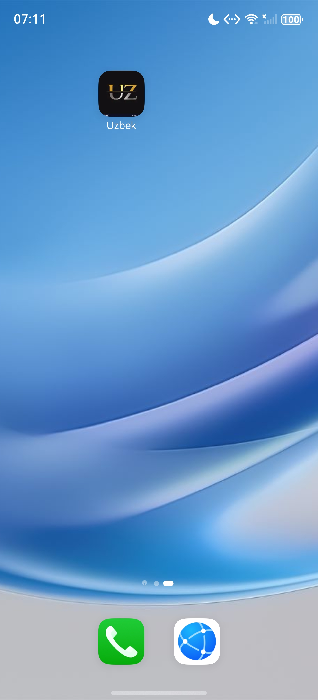
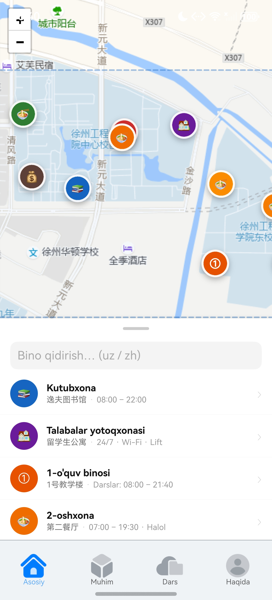
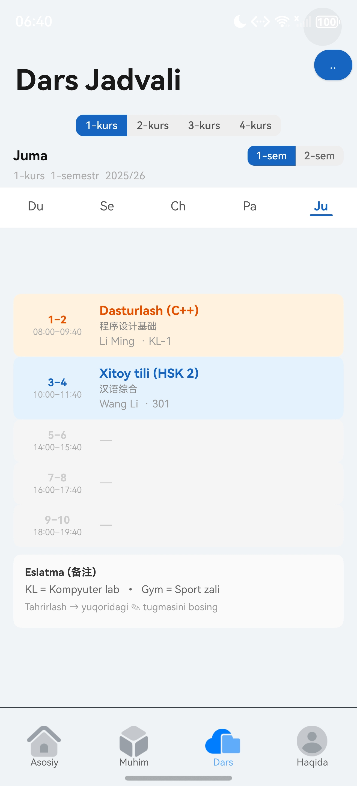

# 🇺🇿 XZUT Guide — O'zbekistonlik Talabalar uchun Qo'llanma

> A HarmonyOS NEXT mobile guide app for Uzbek international students at Xuzhou Institute of Technology (徐州工程学院)

<p align="center">
  
</p>

<p align="center">
  
  &nbsp;&nbsp;
  
</p>

---

## About

**XZUT Guide** is a native HarmonyOS NEXT application designed to help Uzbek international students navigate campus life at XZIT (徐州工程学院), located near Dalong Lake (大龙湖) in Xuzhou, Jiangsu Province, China.

The app provides an interactive campus map, class timetable management, visa process guidance, and essential contact information — all in the **Uzbek language** with Chinese and English support.

## Features

### 🗺️ Interactive Campus Map
- Gaode (高德) tile integration with real-time map rendering
- 10 campus building markers with trilingual popups (Uzbek / Chinese / English)
- Search and filter buildings by name
- Tap-to-focus navigation with fly-to animation
- WGS-84 ↔ GCJ-02 coordinate conversion for accurate positioning

### 📅 Class Timetable
- 4-year × 2-semester schedule grid (8 semesters total)
- Computer Science curriculum with Uzbek translations
- Day-by-day view with 5 class periods
- **Edit mode** — add, modify, or clear class slots with built-in dialog
- Color-coded subjects for quick visual scanning

### 🛂 Visa Guide
- Step-by-step X1 visa process
- Residence permit (居留许可) application guide
- Annual renewal instructions
- Required documents checklist

### ℹ️ About / Haqida
- Emergency contacts (Police 110, Ambulance 120, Fire 119)
- Campus hospital contact
- Useful apps for daily life (WeChat, Alipay, Baidu Translate, DiDi, Meituan)
- Campus address with bilingual display

## Tech Stack

| Layer | Technology |
|-------|-----------|
| Platform | HarmonyOS NEXT (API 12+) |
| Language | ArkTS (TypeScript-based) |
| UI Framework | ArkUI (declarative) |
| Map Engine | Leaflet.js 1.9.4 via WebView |
| Map Tiles | Gaode / AutoNavi (高德) — no API key required |
| Architecture | MVVM (Model-View-ViewModel) |
| Build System | hvigor |

## Project Structure

```
entry/src/main/
├── ets/
│   ├── entryability/       # App entry point
│   ├── pages/              # Main pages (MainPage, VisaPage, TimetablePage)
│   ├── view/               # UI components
│   │   ├── MapComponent.ets          # Campus map with building list
│   │   ├── TimetableComponent.ets    # 4-year schedule viewer + editor
│   │   ├── AboutComponent.ets        # Emergency info & useful apps
│   │   └── VisaComponent.ets         # Visa process guide
│   ├── viewmodel/          # Data models
│   └── common/             # Constants, utilities
└── resources/
    ├── base/               # Default strings & media (Uzbek)
    ├── zh_CN/              # Chinese translations
    ├── en_US/              # English translations
    └── rawfile/
        └── xzit_map.html   # Leaflet map with Gaode tiles
```

## Campus Buildings

| # | Uzbek | Chinese | Type |
|---|-------|---------|------|
| 0 | Kutubxona | 逸夫图书馆 | Library |
| 1 | Talabalar yotoqxonasi | 留学生公寓 | Dormitory |
| 2 | 1-o'quv binosi | 敬中楼 | Teaching |
| 3 | 2-oshxona | 第二餐厅 | Cafeteria |
| 4 | 3-oshxona | 第三餐厅 | Cafeteria |
| 5 | 4-oshxona | 第四餐厅 | Cafeteria |
| 6 | 1-oshxona | 第一餐厅 | Cafeteria |
| 7 | Sport binosi | 体育馆 | Sports |
| 8 | Shifoxona | 校医院 | Hospital |
| 9 | Moliya bo'limi | 财务处 | Finance |

## Coordinate System

The app handles China's coordinate system differences:

```
User Input (Baidu Maps)  →  WGS-84 (stored)  →  GCJ-02 (rendered on Gaode tiles)
         BD-09           →     Standard       →      China offset applied
```

A built-in `wgs84ToGcj02()` converter ensures markers align correctly with Gaode map tiles.

## Setup & Build

### Prerequisites
- [DevEco Studio](https://developer.huawei.com/consumer/en/deveco-studio/) 5.0+
- HarmonyOS SDK (API 12 / compileSdkVersion 6.0.2)
- HarmonyOS NEXT emulator or physical device

### Build
```bash
git clone https://github.com/FOmadbek/uzbek_app.git
cd uzbek_app
# Open in DevEco Studio → Build → Run
```

### Configuration
- Bundle name: `com.xzut.for_uzbeks`
- Target SDK: `6.0.2(22)`
- Compatible SDK: `6.0.2(22)`
- Runtime OS: HarmonyOS

## Author

**Omatillo Fazliddinov (Albert)**
- 🎓 Computer Science, Xuzhou Institute of Technology (XZIT) — Class of 2027
- 🇺🇿 Uzbekistan → 🇨🇳 China
- GitHub: [@FOmadbek](https://github.com/FOmadbek)

## License

This project is for educational purposes. Map tiles © [AutoNavi (高德)](https://www.autonavi.com/). Base template adapted from [Huawei OxHornCampus Codelab](https://gitee.com/harmonyos/codelabs).
